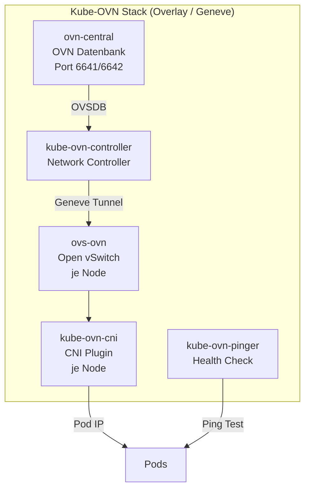

# Kube-OVN CNI — Swiss OTC RKE2

## Überblick

Kube-OVN ist als schaltbare Alternative zu Cilium implementiert. Steuerung via GitHub Repository Variable `CNI_PLUGIN`.

## Aktivierung

```bash
# GitHub Repository Variable setzen
CNI_PLUGIN=kube-ovn   # Kube-OVN (Geneve Overlay)
CNI_PLUGIN=cilium     # Cilium (default)
```

## Architektur



## Konfiguration

| Parameter | Wert |
|-----------|------|
| Version | `kubeovn/kube-ovn v1.13.0` |
| Network Type | `geneve` (Overlay) |
| Pod Subnet | `10.244.0.0/16` |
| Join Subnet | `100.64.0.0/16` |
| NP Implementation | `iptables` |
| Master Label | `kube-ovn/role=master` |

## Bekannte Bootstrap-Probleme & Fixes

### Problem: ovn-central Pending (Bootstrap Deadlock)

**Symptom:**
```
Warning  FailedScheduling  0/3 nodes are available: 
  3 node(s) didn't match Pod's node affinity/selector
```

**Root Cause:**  
Kube-OVN nutzt `nodeSelector: kube-ovn/role=master` für den `ovn-central` Pod.
Dieses Label wird **nicht automatisch** gesetzt — RKE2 setzt es nicht.

**Fix:**  
```bash
# Master-Node labeln vor Helm install
kubectl label node <master-node-name> kube-ovn/role=master --overwrite
```

Im Pipeline-Workflow wird der Master automatisch ermittelt und gelabelt:
```bash
MASTER_HOSTNAME=$(kubectl get nodes \
  -o jsonpath='{.items[?(@.metadata.labels.node-role\.kubernetes\.io/control-plane)].metadata.name}' \
  | awk '{print $1}')
kubectl label node "$MASTER_HOSTNAME" kube-ovn/role=master --overwrite
```

### Problem: Insufficient CPU (s3.large.2 / s3.xlarge.4)

**Symptom:**
```
Warning  FailedScheduling  1 Insufficient cpu, 2 node(s) didn't match selector
```

**Root Cause:**  
`ovn-central` default CPU Request = `300m`. Auf kleinen Nodes (s3.large.2 = 2 vCPU)
zu hoch wenn andere System-Pods laufen.

**Fix:**  
```bash
kubectl patch deployment ovn-central -n kube-system \
  --type strategic \
  --patch '{"spec":{"template":{"spec":{"containers":[{
    "name":"ovn-central",
    "resources":{
      "requests":{"cpu":"100m","memory":"100Mi"},
      "limits":{"cpu":"1","memory":"1Gi"}
    }
  }]}}}}'
```

### Problem: CrashLoopBackOff nach vielen Restarts (MaxBackoff)

**Symptom:**  
CNI Pods zeigen `CrashLoopBackOff` mit 80+ Restarts, obwohl ovn-central jetzt läuft.
Kubernetes wartet bis zu 5 Minuten zwischen Restarts (exponential backoff).

**Fix:**  
Pods löschen → DaemonSet/Deployment erstellt sie frisch ohne Backoff:
```bash
kubectl delete pods -n kube-system -l app=kube-ovn-cni
kubectl delete pods -n kube-system -l app=kube-ovn-controller
```

### Problem: `disable-kube-proxy: true` bricht Kube-OVN v1.13 iptables-Mode

**Entdeckt**: E2E-Test 2026-04-16 auf RKE2 v1.34 + Kube-OVN v1.13.0

**Symptom:**
```
kube-ovn-controller log:
  failed to dial apiserver "https://10.43.0.1:443": timed out dialing host
  (wiederholt alle 3s → CrashLoopBackOff)
```

**Root Cause:**
Kube-OVN v1.13 mit `NP_IMPLEMENTATION=iptables` ist **KEIN** kube-proxy replacement.
Ohne kube-proxy gibt es keine Route für die kube-apiserver ClusterIP (`10.43.0.1`) —
der Controller kann die API nicht erreichen, alles crasht in Kaskade.

**Fix:**
In der RKE2 `/etc/rancher/rke2/config.yaml` darf **kein** `disable-kube-proxy: true` stehen,
wenn Kube-OVN mit iptables läuft. Der richtige Config-Block:
```yaml
token: <rke2-token>
cloud-provider-name: external
cni: none
# KEIN disable-kube-proxy hier!
tls-san:
  - <master-ip>
```

Nur für **Cilium mit `kubeProxyReplacement: true`** darf `disable-kube-proxy: true` gesetzt werden.

### Problem: Helm Chart v1.13.0 — volumeMount/CNI_CONF_DIR Mismatch

**Entdeckt**: E2E-Test 2026-04-16

**Symptom:**
```
kube-ovn-cni init log:
  Installing cni config file "/kube-ovn/01-kube-ovn.conflist"
    to "/var/lib/rancher/rke2/agent/etc/cni/net.d/01-kube-ovn.conflist"
  E failed to mv cni config file
    err="open /var/lib/rancher/rke2/agent/etc/cni/net.d/01-kube-ovn.conflist:
         no such file or directory"
```

**Root Cause:**
Der Helm Chart setzt zwar `cni_conf.CNI_CONF_DIR=/var/lib/rancher/rke2/...` als ENV-Variable,
**aligned aber nicht die zugehörige volumeMount** — die bleibt bei `/etc/cni/net.d`:

| Komponente | Pfad |
|-----------|------|
| hostPath (Host) | `/var/lib/rancher/rke2/agent/etc/cni/net.d` ✅ |
| Container MountPath | `/etc/cni/net.d` ❌ (sollte gleich sein) |
| Binary schreibt nach | `/var/lib/rancher/rke2/agent/etc/cni/net.d` |

Der Binary versucht in einen Container-Pfad zu schreiben, der nicht existiert.

**Fix A: Patch der DaemonSet nach dem Helm install:**
```bash
kubectl patch ds -n kube-system kube-ovn-cni --type='json' -p='[
  {"op": "replace",
   "path": "/spec/template/spec/initContainers/1/volumeMounts/1/mountPath",
   "value": "/var/lib/rancher/rke2/agent/etc/cni/net.d"}
]'
kubectl delete pods -n kube-system -l app=kube-ovn-cni  # force restart
```

**Fix B (Production):** Custom Helm Values-Override mit korrigierter volumeMount, oder warten auf Upstream-Fix
([kubeovn/kube-ovn Issue](https://github.com/kubeovn/kube-ovn) öffnen wenn noch nicht gemeldet).

### Problem: CNI-Verzeichnis existiert nicht (Init-Container crash)

Das Verzeichnis `/var/lib/rancher/rke2/agent/etc/cni/net.d` wird von RKE2 erst erstellt,
wenn sein eigener CNI läuft. Bei `cni: none` existiert der Pfad **nicht** → kube-ovn-cni
kann keine conflist hineinschreiben.

**Fix in cloud-init**: `mkdir -p /var/lib/rancher/rke2/agent/etc/cni/net.d` vor RKE2 start.
Das ist bereits im `compute` Modul (`master-init.sh.tpl`, `worker-init.sh.tpl`) integriert.

## Overlay vs Underlay

| | Overlay (Geneve) | Underlay (OTC VPC) |
|---|---|---|
| **OTC Routing** | ✅ Nicht nötig | ❌ VPC Routes pro Node |
| **Network Policies** | ✅ Vollständig | ✅ Vollständig |
| **Pod IPs** | Eigenes Subnet | Direkte VPC IPs |
| **MTU Overhead** | ~50 bytes (Geneve) | Keiner |
| **OTC Neutron** | ✅ Keine Änderung | ❌ Port-Security anpassen |
| **Installation** | ✅ Einfach | ❌ Aufwändig |
| **Empfehlung** | ✅ **Production-ready** | Nur bei speziellen Anforderungen |

## Troubleshooting

```bash
# Pod-Status
kubectl get pods -n kube-system | grep -E "ovn|kube-ovn"

# ovn-central Logs
kubectl logs -n kube-system deployment/ovn-central

# Controller Logs
kubectl logs -n kube-system deployment/kube-ovn-controller

# CNI Logs auf Node
kubectl logs -n kube-system -l app=kube-ovn-cni --all-containers

# Scheduling Events
kubectl describe pod ovn-central-xxx -n kube-system | grep -A10 Events

# Node Labels prüfen
kubectl get nodes --show-labels | grep kube-ovn
```

---

## RKE2-spezifische Helm-Werte (KRITISCH!)

Der wichtigste Fix für produktiven Betrieb:

```bash
helm upgrade --install kube-ovn kubeovn/kube-ovn \
  --namespace kube-system \
  --set "kubelet_conf.KUBELET_DIR=/var/lib/rancher/rke2/agent/kubelet" \
  --set "cni_conf.CNI_CONF_DIR=/var/lib/rancher/rke2/agent/etc/cni/net.d" \
  --set "cni_conf.CNI_BIN_DIR=/opt/cni/bin"
```

**Ohne diese Parameter:** `kube-ovn-cni` bleibt dauerhaft `0/N Running` (Readiness-Probe sucht `/var/lib/kubelet` — existiert in RKE2 nicht).

**Mit diesen Parametern:** CNI in ~2 Min ready, alle nachfolgenden Pods bekommen Netzwerk.

## Verifizierter E2E-Status (2026-04-03)

```
EVS PVC (Block Storage):   Bound ✅
OBS PVC (Object Storage):  Bound ✅
ELB LoadBalancer:          Automatisch via CCM ✅
HTTP 200:                  Demo App live ✅
```
